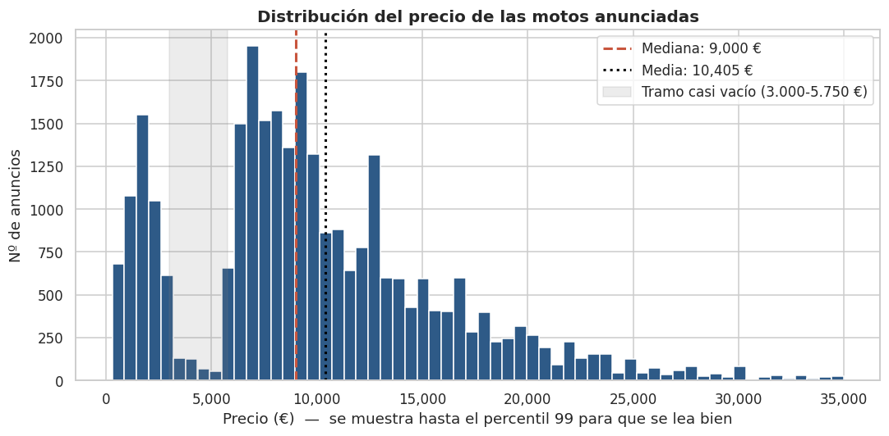
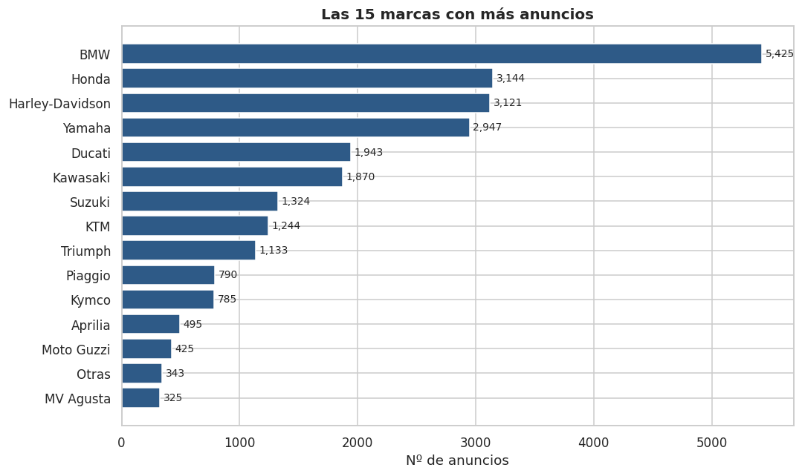
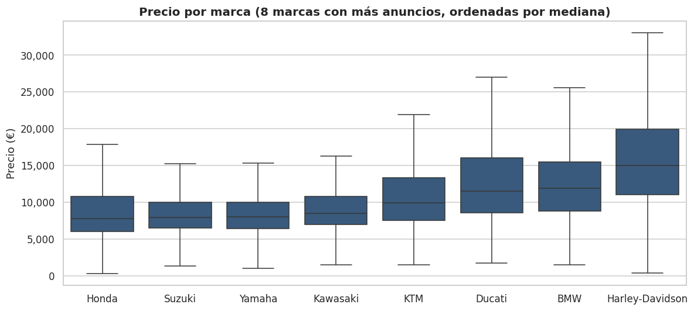
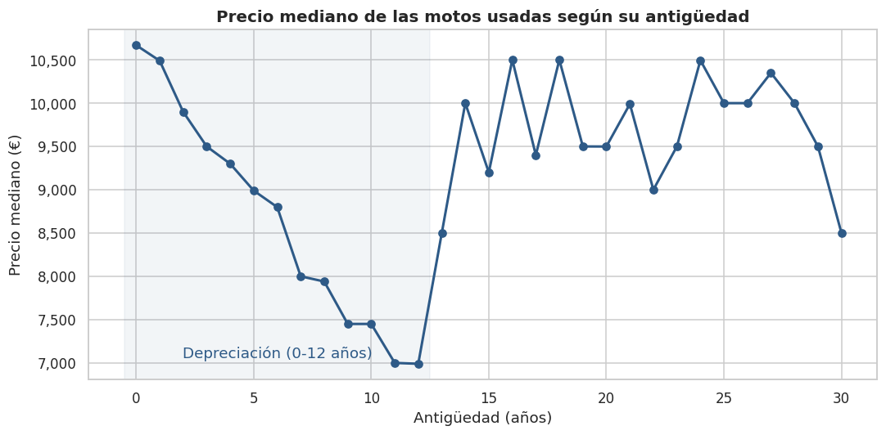
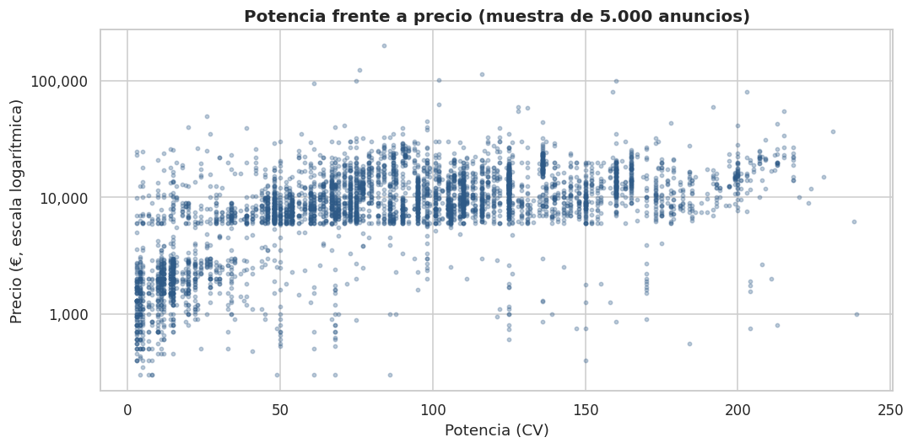

# 🏍️ EDA: mercado europeo de motos de segunda mano

Análisis exploratorio (EDA) de **34.917 anuncios de motos** publicados en un marketplace europeo: carga, exploración de la calidad del dato, limpieza justificada y visualizaciones básicas.

El foco no es el modelado, sino **entender el dataset, detectar sus problemas y dejarlo listo para analizar**.

---

## 📂 Estructura del repositorio

```
├── data/
│   ├── dataset.csv          # Dataset original (sin modificar)
│   └── dataset_clean.csv    # Dataset limpio, generado por el notebook
├── images/                  # Gráficos generados por el notebook
├── notebooks/
│   └── eda.ipynb            # Proceso completo: carga, exploración, limpieza y visualización
├── README.md
└── requirements.txt
```

## ▶️ Cómo ejecutarlo

```bash
pip install -r requirements.txt
cd notebooks
jupyter notebook eda.ipynb
```

El notebook lee `data/dataset.csv` y genera `data/dataset_clean.csv` y las imágenes de `images/`.

---

## 📊 El dataset

- **Fuente:** *Europe Motorbikes*, publicado por [ZenRows](https://www.zenrows.com/datasets/europe-motorbikes). Anuncios extraídos el **16/07/2021** de un gran marketplace europeo de vehículos (por la estructura de los enlaces, AutoScout24).
- **Granularidad:** una fila = un anuncio individual.
- **Variables originales (10):** `price`, `mileage`, `power`, `make_model`, `date` (mes/año de matriculación), `fuel`, `gear`, `offer_type`, `version`, `link`.
- **Naturaleza del dato:** lo introducen los vendedores a mano, así que tiene errores de tecleo, valores de relleno y campos opcionales vacíos. El precio es el **precio pedido**, no el de venta.

---

## 🔍 Exploración: problemas detectados

| # | Problema | Columna(s) | Magnitud |
|---|---|---|---|
| 1 | Anuncios duplicados (mismo `link`) | todas | 5.833 filas |
| 2 | Fecha guardada como texto; motos sin matricular y fechas posteriores a la captura | `date` | 28 + 156 |
| 3 | Precios de relleno (123456, 9999999, 888888888…) o simbólicos (1 €, 50 €) | `price` | ~170 |
| 4 | Kilometrajes de relleno o imposibles (9.999.999 km) | `mileage` | 25 |
| 5 | Motos **usadas** con 0 km (incoherencia entre columnas) | `mileage` + `offer_type` | 121 |
| 6 | Potencias imposibles: cilindradas en la columna de CV, o 1 CV de relleno | `power` | ~750 |
| 7 | Marca y modelo en la misma columna, con marcas de dos palabras | `make_model` | todo |
| 8 | Coches y furgonetas colados (Opel, Fiat Ducato, Jeep) | `make_model` | 5 |
| 9 | Categorías en inglés y con nulos | `fuel`, `gear`, `offer_type` | todo |
| 10 | Texto libre multilingüe con 50% de nulos | `version` | todo |

---

## 🧹 Limpieza aplicada

**Criterio general:** solo se eliminan filas si falla el **precio** (variable principal) o si el registro no pertenece al dominio. Si falla una variable secundaria (km, potencia, fecha), ese valor pasa a **nulo** y se conserva el resto del anuncio.

| Paso | Acción | Justificación | Efecto |
|---|---|---|---|
| Duplicados | Eliminar anuncios con el mismo `link` | El scraping repite anuncios en varias páginas | −5.833 filas |
| Precio | Eliminar precios de relleno, < 300 € o > 250.000 € | No son precios reales; por encima de 250.000 € solo hay relleno | −166 filas |
| Dominio | Eliminar Opel, Fiat y Jeep | Son coches/furgonetas, no motos | −5 filas |
| Fechas | Texto → fecha; sin matricular y futuras → nulo; crear año y antigüedad | Antigüedad calculada respecto a la fecha de captura | 160 nulos |
| Km | > 300.000 km → nulo; usadas con 0 km → nulo | Valores imposibles o incoherentes | 131 nulos |
| Potencia | < 2 CV o > 240 CV → nulo, **sin imputar** | Imputar con la media igualaría scooters y superbikes | 648 anulados |
| Marca/modelo | Separar `make_model` teniendo en cuenta marcas compuestas (Moto Guzzi, MV Agusta…) | Permite analizar por marca | 2 columnas nuevas |
| Categorías | Traducir al español; nulos → `Desconocido` | Legibilidad; no hay forma fiable de deducirlos | 3 columnas |
| Columnas | Quitar `link` y `version`; renombrar en español | Sin valor analítico | 11 columnas finales |

**Resultado:** 28.913 anuncios limpios (**82,8%** de las filas originales). Casi toda la reducción se debe a duplicados.

---

## 📈 Visualizaciones y hallazgos

### Distribución del precio


Mediana de **9.000 €**, con el 50% central entre 6.500 y 13.400 €. La distribución es asimétrica a la derecha y tiene dos grupos (scooters baratos y motos de gama media). Además revela **un hueco entre 3.000 y 5.750 €** que no existe en un mercado real. Es muy probablemente un fallo de la recogida de datos y se documenta como limitación.

### Marcas más frecuentes


**BMW** acapara ≈19% de los anuncios. Las 5 primeras marcas suman el 57%.

### Precio por marca


Las japonesas (Honda, Suzuki, Yamaha, Kawasaki) rondan los 8.000 € de mediana. **Harley-Davidson** es la más cara (15.000 €), casi el doble.

### Precio según la antigüedad


Las motos usadas pierden **~1/3 de su precio en 12 años**. El repunte posterior no es fiable: se debe a un sesgo de selección (clásicas, customs) y al hueco de precios del dataset.

### Potencia frente a precio


La potencia es la variable más relacionada con el precio (Spearman ≈ 0,58). Los km apenas influyen en el precio (≈ −0,10), pero sí van ligados a la antigüedad (≈ 0,63).

---

## ✅ Conclusiones

- Dataset de **28.913 anuncios** tras la limpieza: 90% motos usadas, 87% gasolina, eléctricas ≈1%.
- El precio depende sobre todo de la **marca** y la **potencia**, y cae de forma sostenida con los **primeros 12 años** de antigüedad.
- La calidad original es baja por ser datos introducidos a mano: la limpieza es imprescindible antes de cualquier análisis.

## ⚠️ Limitaciones

- Falta casi todo el tramo de **3.000-5.750 €**, así que los precios medios deben tomarse con cautela.
- Pueden quedar errores no detectables con reglas generales (un precio absurdo dentro del rango válido). Detectarlos exigiría comparar cada anuncio con su modelo.
- `cambio` tiene un 63% de valores desconocidos y no se ha analizado.

---

**Autor:** [Tu nombre] · Máster en Data Science & IA — Evolve Academy
